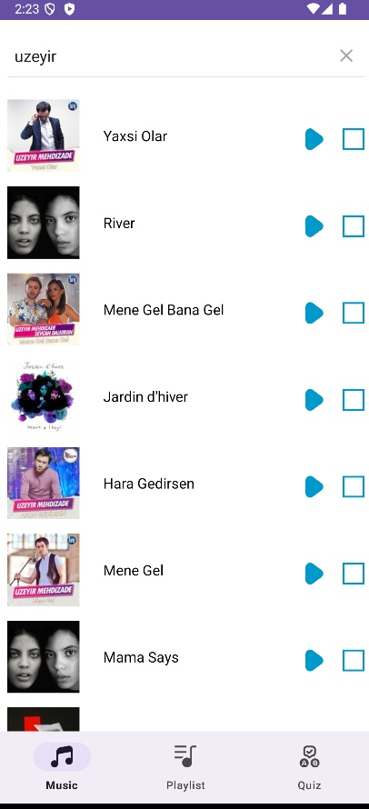
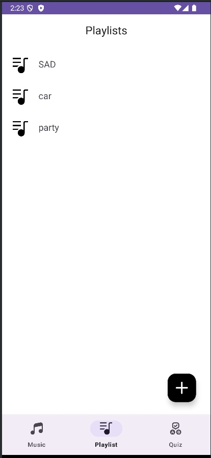
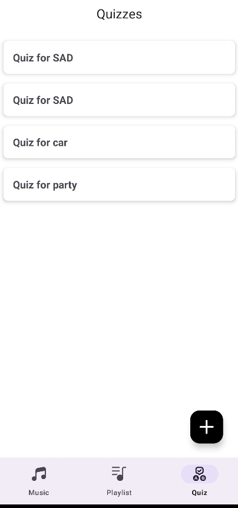
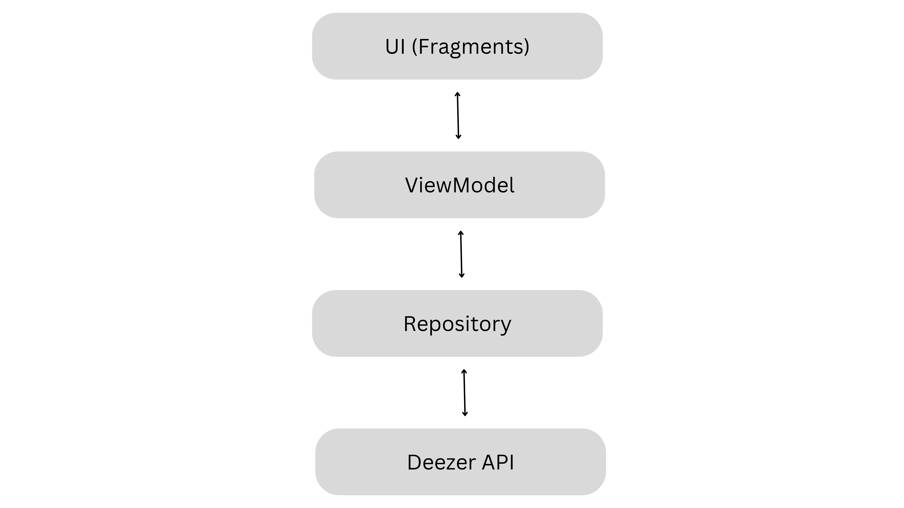

# MusicalQuiz - Music Exploration and Quiz

## 1. Functionalities of the App

The **MusicalQuiz** app is designed to provide a seamless music exploration experience coupled with an engaging quiz functionality. Below are the main features:

### **Features**:
- **Music Search**: Search for tracks or albums using the Deezer API.
- **Search Results**: Display results in a grid layout with album covers, titles, and artist names.
- **Details Screen**: View detailed information about tracks or albums, including a short preview option.
- **Playlists**: Create and manage custom playlists with tracks.
- **Quizzes**: 
  - Create quizzes based on playlists.
  - Play quizzes by guessing tracks from short previews.
  - Two game modes:
    - **Multiple Choice**: Choose the correct track from options.
    - **Fill in the Blanks**: Identify tracks with hints provided.

### **Screenshots**
*Search Screen showing results*  

*Playlist Management Interface*  

*Quiz interface*  

---

## 2. Technical Details

### **App Architecture**

The app is built on the **MVVM (Model-View-ViewModel)** architecture. Below is a simplified architecture diagram:

#### **Implementation Choices**:
- **Single Activity with Fragments**: Each functionality (search, details, playlist, quiz) is hosted by a fragment for modularity.
- **Bottom Navigation**: Ensures smooth navigation between the app's core features.
- **RecyclerView**: Used for displaying search results and playlist items in a grid format.
- **ViewModel**: Maintains UI-related data across configuration changes.
- **Deezer API**: Provides access to music tracks and album information.
- **Kotlin**: Selected for its concise syntax and modern features, ensuring clean and readable code.

---

## 3. Unresolved Technical Challenges

While most features were implemented successfully, the following optional advanced feature was not completed due to time constraints:
- **Configurable Time Limit for Quiz Questions**: Users cannot currently set a custom time limit for answering quiz questions.

---

## 4. Contribution of Team Members

We are a team of two members who divided the tasks as follows:

### **Mahmud Mammadov**:
- Designed the app architecture.
- Implemented the **Search** screens.
- Integrated the **Deezer API** for fetching music data.

### **Turan Abbasli**:
- Developed the **Playlist** and **Quiz** functionalities.
- Implemented the **Multiple Choice** and **Fill in the Blanks** game modes.
